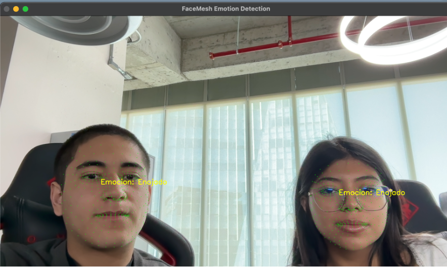
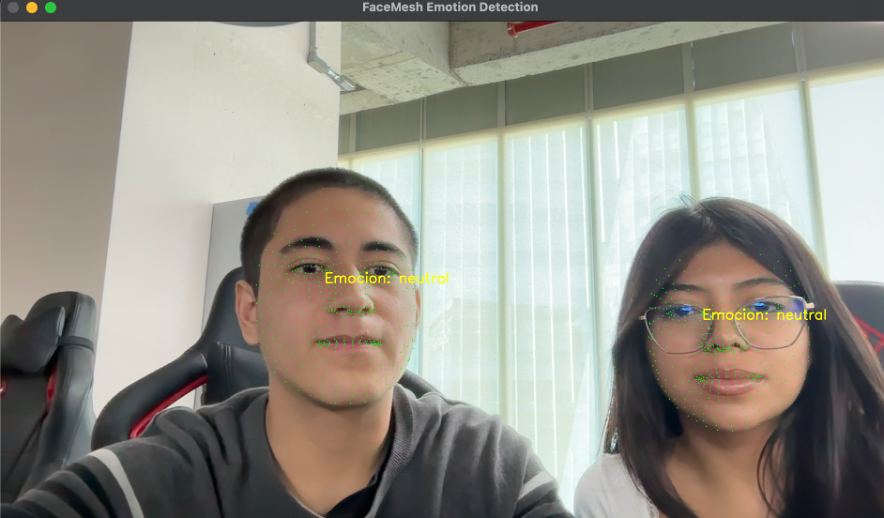

# Reconocimiento de emociones con OpenCV y Mediapipe
Mediante el uso de OpenCV, Mediapipe, Deepface y Python se clasifican emociones en tiempo real.

##  Tabla de Contenido
1. [Ejemplo de ejecución del programa usando OpenCV y Mediapipe](#ejemplo-de-ejecucion-del-programa-usando-opencv-y-mediapipe)
2. [Ejemplo de ejecución del programa usando OpenCV, Mediapipe y DeepFace](#ejemplo-de-ejecucion-del-programa-usando-opencv-mediapipe-y-deepface)
3. [Tecnologías utilizadas](#tecnologías)
4. [Funcionamiento](#funcionamiento)
5. [Características](#caracteristicas)
6. [Instalación y Configuración](#instalacion-y-configuracion)  
   - [Crear y activar el entorno virtual](#crear-y-activar-el-entorno-virtual)  
   - [Instalar requirements](#instalar-requirements)
7. [Links a los códigos](#links-a-los-codigos)
8. [Problemas presentadfos a lo largo del proyecto](#problemas)

---

## Ejemplo de ejecución del programa usando Open Cv y Mediapipe <a name="#ejemplo-de-ejecucion-del-programa-usando-opencv-y-mediapipe"></a>

## Ejemplo de ejecución del programa usando Open Cv, Mediapipe y Deepface <a name="ejemplo-de-ejecucion-del-programa-usando-opencv-mediapipe-y-deepface"></a>


## Tecnologías utilizadas <a name="tecnologías"></a>

+ **Deep Face:** Para el reconocimiento de emociones

+ **MediaPipe:** Para la detección de rostros en tiempo real

+ **OpenCV:** Para la manipulación de imágenes y video


## Funcionamiento <a name="funcionamiento"></a>


## Características <a name="caracteristicas"></a>
- Detecta hasta 2 rostros usando MediaPipe
- Detecta y visualiza puntos clave en la cara y los dibuja con puntos color verde
- El modelo indentifica emciones como : neutral, sorprendido, enojado.
- Se muestra la emoción detectada

## Instalación y configuración <a name="instalacion-y-configuracion"></a>
```bash
git clone https://github.com/usuario/proyecto-emociones.git
cd proyecto-emociones
```

### Crear y activar el entorno virtual <a name="#crear-y-activar-el-entorno-virtual"></a>
```bash
python -m venv env
source env/bin/activate  # En macOS/Linux
env\Scripts\activate     # En Windows
```
### Instalar requirements <a name="#instalar-requirements"></a>
```bash
pip install -r requirements.txt
```
## Links a los códigos <a name="#links-a-los-codigos"></a>
[Código usando Mediapipe](src/prueba2.py)

[Código usando Deepface](src/prueba3.py)

## Problemas presentados durante el desarrollo del proyecto <a name="#problemas"></a>
1. **OpenCv no detectaba la cámara:**
    +	**Problema**: OpenCV arrojaba el error:
      
       can't open camera by index
   >
    lo que indicaba que no podía acceder a /dev/video0.
    +	**Causa**: Pi Camera Module 3 no usa V4L2 (Video4Linux2) por defecto, sino que está diseñada para funcionar con libcamera en Raspberry Pi OS.
    +	**Solución**: Se intentó con `v4l2-ctl --list-devices`
     	 para identificar los dispositivos y se probó usar `libcamera-hello`, que sí reconoció la cámara.

2. **Se detectaban muchos dispositivos en /dev/video:**
   + **Problema:** ls /dev/video* arrojaba una gran cantidad de dispositivos (/dev/video0, /dev/video1, /dev/video20-/dev/video35), lo que hacía difícil identificar cuál era la cámara real.
	+ **Causa:** Raspberry Pi usa varios dispositivos virtuales para la GPU, procesamiento de video y diferentes pipelines de captura.
	+	**Solución:** Se ejecutó `v4l2-ctl --list-devices` y `libcamera-hello --list-cameras` para identificar la cámara correcta, que resultó ser imx708 con /dev/video0.

3. **Problemas al instalar picamera2:**
	+	**Problema:** Se intentó instalar picamera2, pero arrojaba el error:
   > No module named 'libcamera'

  	
También falló la instalación de pykms, una dependencia requerida para la visualización con DRM.
   +  **Causa:**
	    1.	libcamera no estaba disponible en el entorno virtual.
	    2.	Se intentó instalar pykms, pero no existe en PyPI y no se podía instalar con pip.
   + **Solución:**
	    1. Se enlazó libcamera dentro del entorno virtual, pero al final no funcionó correctamente con picamera2.
	    2. Se recomendó usar libcamera directamente en lugar de OpenCV/V4L2.
    
 4. **No aparecía la imagen en la transmisión de Flask:**
	+ **Problema:** Aunque Flask estaba corriendo en la Raspberry Pi, al acceder desde otra computadora en http://192.168.100.17:5000/video_feed, la página aparecía en blanco.
	+ **Causa:**
 	    1. El firewall UFW estaba bloqueando el puerto 5000.
	    2. OpenCV no estaba accediendo correctamente a la cámara.
            3. La IP era accesible, pero Chrome bloqueaba la conexión (probablemente por HTTP en lugar de HTTPS).
	+ **Solución:**
	    1. Se usó
   		    ```sudo ufw allow 5000/tcp
        ```
         pero ufw estaba desactivado, por lo que no afectaba.
    	    2. Se probó abrir http://192.168.100.17:5000 en Safari, y funcionó, lo que confirmó que Chrome estaba bloqueando la conexión.

